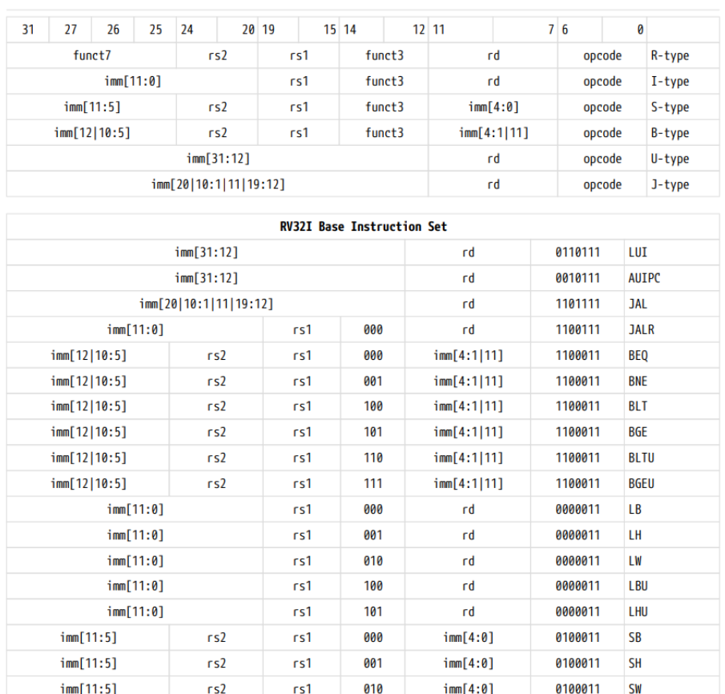
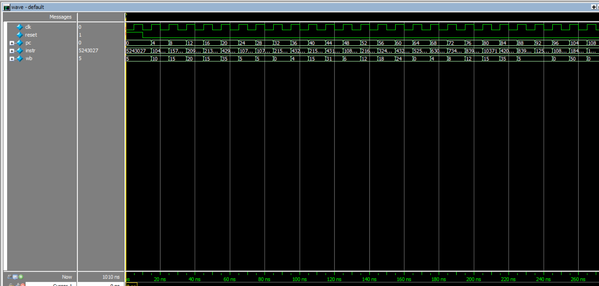
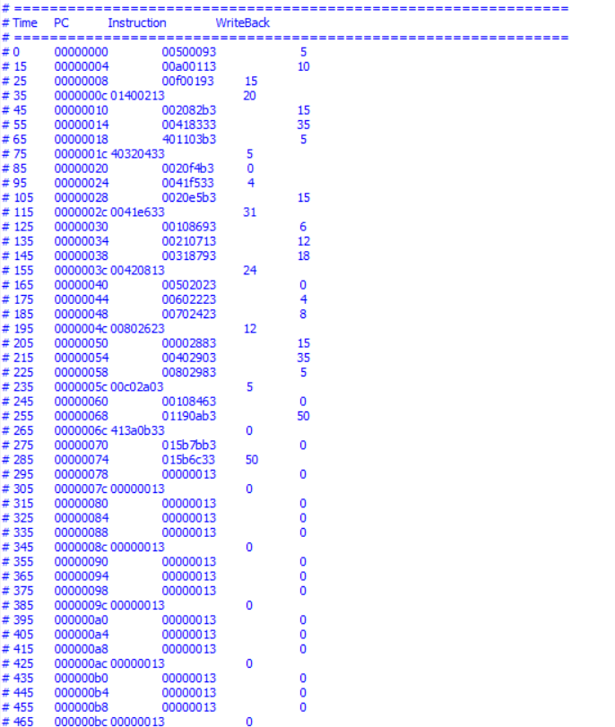

# RV32I Single-Cycle RISC-V Processor

A 32-bit Single-Cycle RISC-V processor implementing the RV32I base integer instruction set using Verilog HDL.

## Overview

This project presents the design and verification of a modular 32-bit RISC-V processor based on a single-cycle architecture.

Each instruction completes execution within one clock cycle by passing through the instruction fetch, decode, execute, memory access, and write-back stages.

The processor was designed using Verilog HDL and functionally verified using ModelSim/QuestaSim simulation.

---

# Features

- 32-bit RV32I architecture
- Single-cycle datapath implementation
- Modular RTL design approach
- Separate instruction and data memory
- Register file implementation
- Immediate generation logic
- Arithmetic and logical operations
- Branch and jump support
- Load and store instructions
- ModelSim/QuestaSim verified

---

# Processor Architecture

The processor consists of the following major components:

- Program Counter
- Instruction Memory
- Instruction Decoder
- Control Unit
- Register File
- Immediate Generator
- Arithmetic Logic Unit
- Data Memory
- Multiplexers
- Write-back logic


## Block Diagram


## Instruction Set Architecture




---

# Datapath Operation

The processor follows a conventional single-cycle execution flow:

```
Instruction Fetch
        |
        ↓
Instruction Decode
        |
        ↓
Execute / ALU Operation
        |
        ↓
Memory Access
        |
        ↓
Register Write Back
```


---

# RTL Modules

| Module | Description |
|--------|-------------|
| Program Counter | Stores address of current instruction |
| Instruction Memory | Stores processor instructions |
| Register File | Contains 32 general purpose registers |
| Immediate Generator | Generates immediate values |
| Control Unit | Generates control signals |
| ALU | Performs arithmetic and logical operations |
| Data Memory | Handles load/store operations |
| Multiplexers | Data path selection logic |


---

# Supported RV32I Instructions

## Arithmetic

- ADD
- SUB


## Logical

- AND
- OR
- XOR


## Immediate Operations

- ADDI
- ANDI
- ORI
- XORI


## Memory Operations

- LW
- SW


## Branch Instructions

- BEQ
- BNE
- BLT
- BGE


## Jump Instructions

- JAL
- JALR


---

# Verification

The processor was verified using a dedicated Verilog testbench.

Verification included:

- Clock generation
- Reset operation
- Instruction execution
- Register updates
- ALU output checking
- Memory access verification


Simulation Environment:

- ModelSim
- QuestaSim


---

# Simulation Results

The following waveforms demonstrate correct processor operation.


## Processor Execution




## Arithmetic Operations




---

# Repository Structure

```
02-RV32I-Single-Cycle-Processor

├── RTL
│   ├── ALU
│   ├── Control Unit
│   ├── Register File
│   ├── Instruction Memory
│   ├── Data Memory
│   └── Top Module
│
├── Testbench
│
├── Simulation
│   ├── compile.do
│   ├── simulate.do
│   └── run.do
│
├── Images
│
├── Waveforms
│
├── LICENSE
└── README.md
```

---

# Tools Used

## Hardware Description Language

- Verilog HDL


## Simulation

- ModelSim
- QuestaSim


## Development Environment

- Visual Studio Code
- Git
- GitHub


---

# Future Improvements

Possible future enhancements:

- Pipeline implementation
- FPGA prototyping
- Cache integration
- Branch prediction
- RV32M extension support
- Power optimization techniques


---

# Author

**Sriram Sainath**

Electronics and Communication Engineering

---

# License

This project is licensed under the MIT License.